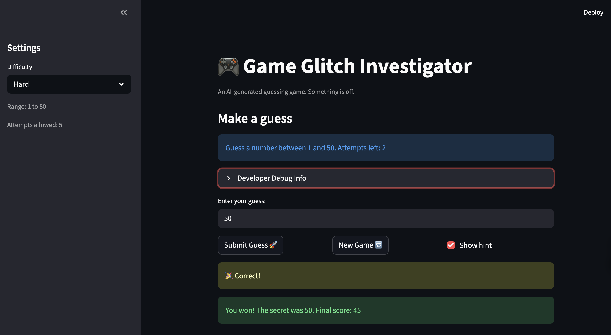

# 🎮 Game Glitch Investigator: The Impossible Guesser

## 🚨 The Situation

You asked an AI to build a simple "Number Guessing Game" using Streamlit.
It wrote the code, ran away, and now the game is unplayable. 

- You can't win.
- The hints lie to you.
- The secret number seems to have commitment issues.

## 🛠️ Setup

1. Install dependencies: `pip install -r requirements.txt`
2. Run the broken app: `python -m streamlit run app.py`

## 🕵️‍♂️ Your Mission

1. **Play the game.** Open the "Developer Debug Info" tab in the app to see the secret number. Try to win.
2. **Find the State Bug.** Why does the secret number change every time you click "Submit"? Ask ChatGPT: *"How do I keep a variable from resetting in Streamlit when I click a button?"*
3. **Fix the Logic.** The hints ("Higher/Lower") are wrong. Fix them.
4. **Refactor & Test.** - Move the logic into `logic_utils.py`.
   - Run `pytest` in your terminal.
   - Keep fixing until all tests pass!

## 📝 Document Your Experience

- [ ] Describe the game's purpose.

   The purpose of the game is to let users guess a secret number within a given range. The number range and the attempt limit change depending on the selected difficulty level. The game also provides hint messages to guide the user after each guess.
- [ ] Detail which bugs you found.

   1. The hint messages sometimes gave incorrect feedback to the user.

   2. The New Game button did not properly restart the game after a session ended.

   3. The target number appeared to keep changing while the game was being played.

   4. The target number did not reset correctly when the user selected a different difficulty level.

   5. The user’s remaining attempts could become negative.

- [ ] Explain what fixes you applied.

   1. I fixed the hint message bug by correcting the comparison logic so that the feedback matched the actual guess result.

   2. I fixed the New Game button bug by adding and properly resetting a status variable so the game could restart correctly after a win or loss.

   3. I fixed the target number issue by keeping the secret number in a consistent data type and removing hardcoded range bounds, so the number stayed stable and matched the selected difficulty.

   4. I fixed the negative attempts bug by resetting attempts to 0 at the start of each new game. I also updated the game logic so that attempts are incremented correctly and compared with the attempt limit each time, which prevents the remaining attempts from becoming negative.

## 📸 Demo

- [ ] [Insert a screenshot of your fixed, winning game here]

## 🚀 Stretch Features

- [ ] [If you choose to complete Challenge 4, insert a screenshot of your Enhanced Game UI here]
